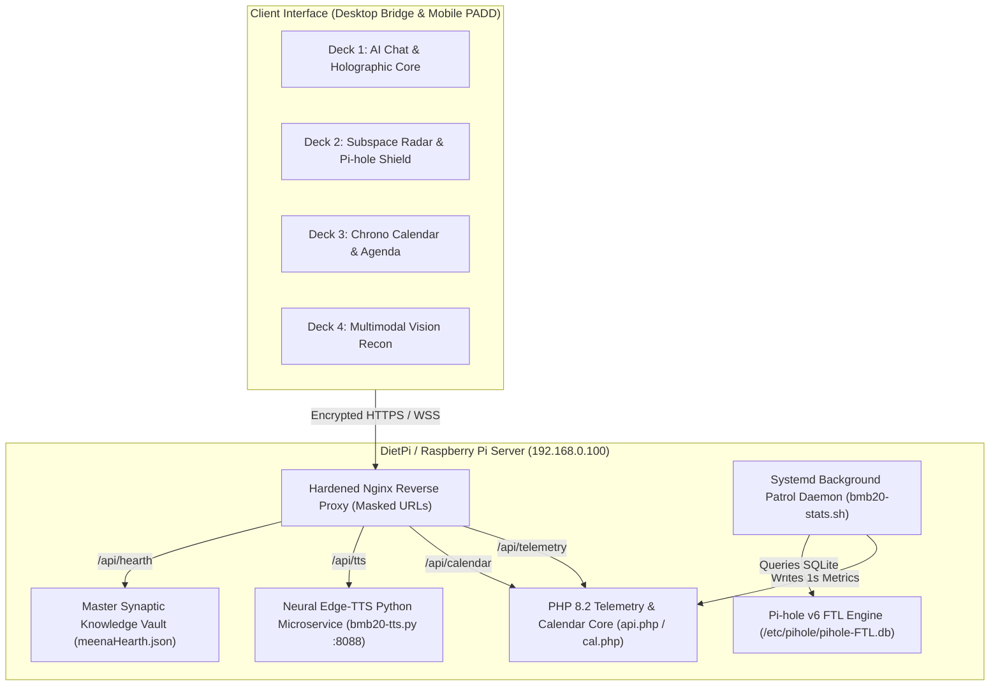

<div align="center">

# 🌟 MEENA™ — Autonomous Sovereign Home AI & Tactical Operations Center
### *Takahara Academy (高原学園) // Enterprise-Grade, Self-Hosted SBC Command Engine*

[](https://github.com/manaphassan/bmb20/releases)
[](https://dietpi.com)
[%20%7C%20Gemini%20Flash-00E676?style=for-the-badge&logo=google-gemini&logoColor=black)](https://github.com/manaphassan/bmb20)
[](https://github.com/manaphassan/bmb20)
[](https://nginx.org/)
[](LICENSE)

<br/>

```
  ========================================================================================
   [ 高原学園 ]   MEENA™ HOME AI BRIDGE   //   SOVEREIGN SMART OPERATIONS CENTER 
  ========================================================================================
   • 100% Self-Hosted & Private     • Bilingual Voice (EN + BM)       • Studio Neural TTS Daemon
   • Dual Starfleet & PADD UI       • Multimodal Camera Vision Recon  • Subspace LAN Radar 2.0
   • Pi-hole v6 Real-Time SQLite    • Chrono Calendar & Waktu Solat   • Zero-Cloud Fallback
  ========================================================================================
```

<p align="center">
  <a href="#-key-product-features"><b>Key Features</b></a> •
  <a href="#-deck-architecture"><b>Deck Architecture</b></a> •
  <a href="#-bilingual-ai--neural-speech"><b>Bilingual Voice</b></a> •
  <a href="#-security--endpoint-masking"><b>Security & APIs</b></a> •
  <a href="#-quick-start--installation"><b>Quick Start</b></a> •
  <a href="#-live-interactive-showcase"><b>Live Showcase</b></a>
</p>

---

</div>

## 📖 Product Overview

**MEENA™** (*Master Electronic Executive Neural Assistant*) is a self-hosted, privacy-first **Sovereign Home AI & Personal Infrastructure Command Center** engineered specifically for single-board computers (Raspberry Pi 3/4/5, Orange Pi, Rockchip SBCs) running **DietPi or Debian Linux**.

Built from the ground up for zero-latency, always-on smart home operations, MEENA™ turns your low-power SBC into a high-tech Starfleet LCARS Command Bridge with hands-free voice interactions, live device radar, automated schedule enforcement, privacy DNS filtering, and real-time vision analytics—all running directly inside your home network with zero mandatory external subscriptions.

---

## ⚡ Key Product Features

### 🧠 1. Sovereign Bilingual Neural Brain (EN + BM)
* **Hybrid Dual-Brain Architecture**: Fluidly blends cloud intelligence (Google Gemini 1.5 Flash via official API) for deep contextual reasoning with a **100% autonomous local rule-based offline engine** that handles system control even when the Internet is disconnected.
* **Native Bahasa Melayu & English Comprehension**: Automated Malay affix normalization, local terminology detection, and dual-language Wikipedia query resolution (`ms.wikipedia.org` + `en.wikipedia.org`).
* **5 AI Persona Skillsets**: Deep Research Specialist, Technical Report Auditor, Morale Booster, Fact-Checker, and Autonomous Self-Learning Knowledge Vault.

### 🎙️ 2. Edge Studio Neural Speech (TTS)
* **Server-Side Python Async Daemon (`bmb20-tts.py`)**: Runs locally on port `8088`, generating studio-grade neural voice output with zero browser synthesis latency.
* **Deterministic MD5 Caching**: Instant replay of recurring briefings and time announcements from high-speed disk cache.
* **Studio Voice Profiles**: Support for `Jenny`, `Aria`, `Sonia`, `Yasmin`, `Osman`, `Guy`, with dynamic pitch, cadence, and rate controls.

### 🛡️ 3. Real-Time Pi-hole v6 SQLite Integration
* **Direct Embedded Database Queries**: Queries `/etc/pihole/pihole-FTL.db` directly via `pihole-FTL sqlite3 -ni` for zero-lag blocking metrics.
* **Live Telemetry & Gravity Counts**: Monitors millions of blocked ad/tracker domains, query volume today, and real-time block percentages (`45.6% BLK`).
* **One-Click Shield Management**: Instant temporary shield disable (10s, 30s, 5m) or toggle directly from the tactical interface.

### 📡 4. Subspace Network Radar 2.0 (LAN Topology)
* **Real-Time ARP Table Inspection**: Continuous `/proc/net/arp` polling across `eth0` and `wlan0`.
* **Hardware Device Fingerprinting**: Categorizes connected devices into Routers, Phones, Workstations, IoT Sensors, and Gaming Consoles with live ping round-trip times and MAC vendors.

### 👁️ 5. Multimodal Vision Recon & Optical Inspection (Deck 4)
* **Live Camera Stream Analytics**: Seamless WebRTC / USB camera capture with snapshot freeze and frame inspection.
* **Multimodal OCR & Object Classification**: Passes visual frames directly to Gemini 1.5 Flash Vision for real-time document OCR, whiteboard transcription, component inspection, and perimeter safety monitoring.

### 📅 6. Chrono Calendar & Automated Waktu Solat Engine
* **Private Multi-Source iCal Parser (`cal.php`)**: Synchronizes multiple Google/Apple/Outlook ICS feeds with local JSON storage, multi-line folding repair, and `Asia/Kuala_Lumpur` timezone formatting.
* **Waktu Solat Routine Scheduler**: Calculates sub-second Malaysian prayer times (Imsak, Subuh, Syuruk, Zohor, Asar, Maghrib, Isyak) using high-precision astronomical algorithms with audio Adhan alerts and daily routine briefings.

### 📱 7. Starfleet Dual-Layout System (Desktop Bridge & Handheld PADD)
* **Desktop Command Bridge**: High-density 4-Deck LCARS operations layout with Three.js 3D WebGL globe, ISS orbital tracking ($27,580\text{ km/h}$), and dynamic obsidian force-directed knowledge graph.
* **Handheld PADD Communicator**: Ultra-ergonomic mobile interface featuring touch Hold-To-Talk Push-To-Talk (PTT), real-time chat stream, horizontal quick chips, and slide-up hardware diagnostics drawer.

---

## 🏛️ 4-Deck Operations Architecture



---

## 🌐 Bilingual AI & Neural Speech Profiles

| Language | Neural Engine Profile | Example Voice Commands |
|---|---|---|
| **English** | `en-US-JennyNeural`<br/>`en-US-AriaNeural`<br/>`en-GB-SoniaNeural` | • *"What is our current system status?"*<br/>• *"Explain quantum computing in simple terms"*<br/>• *"Purge Linux memory buffers and cache"*<br/>• *"Give me the morning mission briefing"* |
| **Bahasa Melayu** | `ms-MY-YasminNeural`<br/>`ms-MY-OsmanNeural` | • *"Siapa saintis yang cipta teori relativiti?"*<br/>• *"Berapa suhu CPU DietPi sekarang?"*<br/>• *"Bila masuk waktu solat Zohor hari ini?"*<br/>• *"Tunjukkan peranti yang aktif atas rangkaian WiFi"* |

---

## 🔒 Security Hardening & Endpoint Masking

The system features production-hardened Nginx rules designed to block path traversal, prevent script execution, and obscure file extensions:

| Clean Endpoint | Target Payload | Purpose & Security Gate |
|---|---|---|
| `/dashboard` | `/index.html` | High-density Starfleet Bridge Dashboard |
| `/settings` | `/settings.html` | Configuration & Gemini API Key Vault |
| `/api/telemetry` | `api.json` | Real-time 1-second hardware & Pi-hole metrics |
| `/api/calendar` | `calendar_events.json` | Chrono Calendar pre-rendered agenda |
| `/api/calendar/config` | `calendar_config.json` | Calendar URL subscription manager |
| `/api/hearth` | `meenaHearth.json` | Synaptic master memory storage |
| `/api/tts` | Reverse Proxy `:8088` | Asynchronous neural audio synthesizer |
| `/daemon/*` | **HTTP 404 BLOCKED** | Sensitive bash & python system scripts protected |

---

## 🚀 Quick Start & Installation

### Prerequisites
* Raspberry Pi 3B / 3B+ / 4B / 5 or any Debian/Armbian SBC.
* DietPi OS (Debian 12 Bookworm / 13 Trixie recommended).
* Nginx, PHP 8.2+ CLI, Python 3.11+, and `edge-tts`.

### 1. Automated Deployment (From Local Machine)
Clone the repository and run the automated PowerShell deployment script targeting your DietPi SBC:

```powershell
git clone https://github.com/manaphassan/bmb20.git
cd bmb20
powershell -ExecutionPolicy Bypass -File .\deploy.ps1 -TargetHost "dietpi.local"
```

### 2. Manual Installation (Directly on DietPi Host)
```bash
# Clone to web root
sudo git clone https://github.com/manaphassan/bmb20.git /var/www/html
cd /var/www/html

# Run native installer
sudo bash deploy-dietpi.sh
```

### 3. Access the Dashboard
Open any browser on your local network:
* **`http://dietpi.local/dashboard`** or **`http://192.168.0.100/dashboard`**

---

## ⌨️ Tactical Keyboard Shortcuts

| Key | Action | Description |
|:---:|---|---|
| <kbd>1</kbd> | **Deck 1** | Switch to AI Assistant Bridge & Chat Stream |
| <kbd>2</kbd> | **Deck 2** | Switch to Subspace Radar & Observatory |
| <kbd>3</kbd> | **Deck 3** | Switch to Chrono Calendar & Agenda |
| <kbd>4</kbd> | **Deck 4** | Switch to Multimodal Camera Recon & OCR |
| <kbd>Space</kbd> | **Voice PTT** | Hold to talk to MEENA (Push-To-Talk) |
| <kbd>M</kbd> | **Toggle Mic** | Mute / Unmute continuous wake-word listening |
| <kbd>D</kbd> | **AI Dossier** | Open MEENA operational profile and skill metrics |
| <kbd>P</kbd> | **Pi-hole Shield** | Open Pi-hole defense shield modal |
| <kbd>A</kbd> | **Toggle Audio** | Enable / Mute LCARS sound effects & voice |

---

## 📦 Project Ecosystem & File Map

```
bmb20/
├── assets/
│   ├── css/style.css            # LCARS Starfleet styling & custom animations
│   └── js/
│       ├── audio.js             # Web Audio API procedural sound synthesizer
│       ├── calendar.js          # Chrono Calendar engine & date selector
│       ├── camera-recon.js      # Deck 4 WebRTC camera recon & Gemini OCR
│       ├── config.js            # Global environment configuration
│       ├── globe.js             # Three.js 3D WebGL Earth & ISS satellite tracker
│       ├── layout-manager.js    # Starfleet dual-layout manager (Bridge & PADD)
│       ├── main.js              # Voice recognition, chat engine, & LLM router
│       ├── routine-scheduler.js # Waktu Solat calculation & daily routine alarms
│       ├── settings.js          # Configuration, API keys, & Hearth management
│       └── telemetry.js         # Real-time hardware, Pi-hole, & LAN radar polling
├── daemon/
│   ├── bmb20-stats.sh           # Linux hardware & Pi-hole SQLite collector
│   ├── bmb20-stats.service      # Systemd service for stats collection
│   ├── bmb20-tts.py             # Python edge-tts asynchronous speech server
│   ├── bmb20-tts.service        # Systemd service for neural speech
│   └── nginx-hardened.conf      # Hardened Nginx configuration & route masking
├── docs/
│   └── index.html               # GitHub Pages live showcase landing page
├── index.html                   # Main 4-Deck Command Bridge & PADD Communicator
├── settings.html                # Settings, API Vault, & Persona Configuration
├── api.php                      # Telemetry & Sudo API router
├── cal.php                      # Private iCalendar parser & multi-feed synchronizer
├── deploy.ps1                   # One-click Windows remote deploy script
├── deploy-dietpi.sh             # Native DietPi deployment & permission manager
└── meenaHearth.json             # Core synaptic memory vault
```

---

## 🌟 Live Interactive Showcase

Visit the official documentation showcase landing page on GitHub Pages:
👉 **[https://manaphassan.github.io/bmb20/](https://manaphassan.github.io/bmb20/)**

---

## 📜 License & Acknowledgments

* **License**: Open-source under the [MIT License](LICENSE).
* **Crafted for**: **Takahara Academy (高原学園)** by [Manap Hassan](https://github.com/manaphassan).
* **Inspiration**: Starfleet LCARS, Okuda Design Standards, and sovereign smart home automation.
