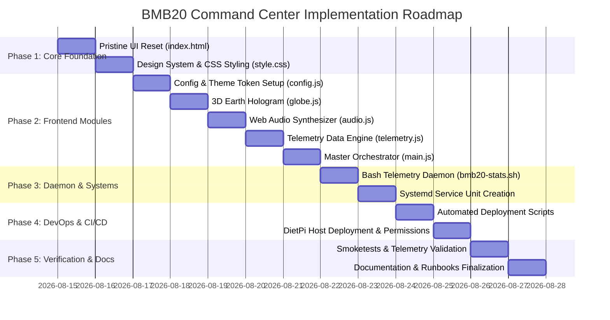

# 🚀 DietPi LCARS Command Center (BMB20)
## Complete Architecture Guide & Engineering Roadmap

This document serves as the master engineering guide, technical specification, and multi-phase execution roadmap for developing, deploying, and maintaining the **LCARS Command Center** on a **Raspberry Pi 3** (`192.168.0.100` / `dietpi.local`).

---

# 📑 Table of Contents
1. [Executive Summary & Core Philosophy](#1-executive-summary--core-philosophy)
2. [Target Hardware & Runtime Environment](#2-target-hardware--runtime-environment)
3. [System Architecture & Data Flow](#3-system-architecture--data-flow)
4. [Modular File Structure Specification](#4-modular-file-structure-specification)
5. [Engineering Standards & Guidelines](#5-engineering-standards--guidelines)
6. [Security & Hardening Protocol](#6-security--hardening-protocol)
7. [Phased Implementation Roadmap](#7-phased-implementation-roadmap)
8. [Verification & Acceptance Criteria](#8-verification--acceptance-criteria)

---

# 1. Executive Summary & Core Philosophy

The **BMB20 LCARS Command Center** is a high-performance, single-pane-of-glass dashboard for monitoring self-hosted services (Pi-hole, Syncthing, Jellyfin, Tailscale) and real-time hardware telemetry on a Raspberry Pi 3.

### Core Tenets:
* **Zero-Build, Pure Web Standards**: HTML5, Vanilla ES6 JavaScript modules, Tailwind CSS, and Three.js. Zero compilation steps, zero Webpack/Vite overhead.
* **Near-Zero Server Footprint**: Nginx serves static assets directly from memory cache (< 0.1% CPU). A lightweight background Bash telemetry daemon (`bmb20-stats.sh`) runs as a native systemd service, avoiding heavy PHP/Node.js runtimes.
* **Authentic Star Trek LCARS Aesthetics**: High-contrast Okuda color hierarchy, CRT phosphor scanlines, 3D WebGL tactical Earth hologram, and Web Audio API synthesizer feedback.

---

# 2. Target Hardware & Runtime Environment

| Parameter | Specification | Notes |
| :--- | :--- | :--- |
| **Host Device** | Raspberry Pi 3 Model B | Quad-Core ARM Cortex-A53 @ 1.2GHz, 1GB LPDDR2 RAM |
| **Operating System** | DietPi (Debian Bookworm base) | Lightweight Linux distribution |
| **Web Server** | Nginx (or Lighttpd) | Static file serving at `/var/www/html/` & `/var/www/` |
| **Host Networking** | Static IP: `192.168.0.100` | Hostname: `dietpi.local` |
| **Telemetry Channel** | Local atomic file `api.json` | Generated every 1000ms by `bmb20-stats.sh` |

---

# 3. System Architecture & Data Flow

```mermaid
graph TD
    subgraph Raspberry Pi 3 Host
        HW[Hardware / Linux Kernel] -->|/proc/stat, /sys/thermal, /proc/net/dev, /proc/net/arp| DAEMON[bmb20-stats.sh Daemon]
        SYSTEMD[bmb20-stats.service] -->|Manages & Auto-restarts| DAEMON
        DAEMON -->|Atomic write every 1s| JSON[/var/www/html/api.json]
        NGINX[Nginx Web Server] -->|Serves static memory cache| JSON
        NGINX -->|Serves static files| WEB[HTML5 / CSS / ES6 JS]
    end

    subgraph Client Browser / Touchscreen
        WEB -->|1. Initial Load| BROWSER[Client Browser Engine]
        JSON -->|2. Polling every 1000ms| TELEMETRY[telemetry.js]
        TELEMETRY -->|Updates| UI[LCARS DOM Elements]
        TELEMETRY -->|Draws Waveform| CANVAS[Canvas 2D Bandwidth Graph]
        BROWSER -->|Initializes| THREE[globe.js / Three.js 3D Earth]
        BROWSER -->|Initializes| AUDIO[audio.js / Web Audio Synth]
    end
```

---

# 4. Modular File Structure Specification

```text
d:\HaNa_Innovation\bmb20\ (Target: /var/www/html/ on DietPi)
├── index.html              # Clean semantic LCARS DOM layout (< 450 lines)
├── css/
│   └── style.css           # Authentic LCARS styling, CRT scanlines, 100vh lock, animations
├── js/
│   ├── main.js             # Master lifecycle orchestrator, Page Visibility API
│   ├── config.js           # Tailwind theme tokens & service launcher mappings
│   ├── telemetry.js        # Polling engine for api.json, gauges, bandwidth & LAN list
│   ├── globe.js            # Three.js 3D Hologram, realistic continent sampling & beacon
│   └── audio.js            # Web Audio API bridge sounds, tactical chirps & warp hum
├── daemon/
│   ├── bmb20-stats.sh      # Native Linux telemetry collector script
│   └── bmb20-stats.service # Systemd background service unit
├── docs/
│   ├── DESIGN.md           # Visual design tokens & color hierarchy
│   ├── API_SPEC.md         # JSON schema documentation for telemetry
│   └── CHANGELOG.md        # Semantic version history
├── api.json                # Live telemetry snapshot
├── deploy.ps1              # One-click Windows PowerShell deployment pipeline
└── deploy-dietpi.sh        # Remote DietPi installation & permission fixer
```

---

# 5. Engineering Standards & Guidelines

### A. Frontend Rules
1. **Zero Monoliths**: Logic is strictly partitioned (`telemetry.js` handles data, `globe.js` handles 3D, `audio.js` handles sound).
2. **Graceful Subsystem Isolation**: A WebGL context loss or audio autoplay restriction will **never** crash the telemetry polling engine.
3. **100vh Viewport Lock**: Use strict `height: calc(100vh - 28px)` with `overflow: hidden` to guarantee a true hardware monitor feel without scrollbars.
4. **Eco-Mode Optimization**: Listen to `document.visibilitychange`. Pause Three.js render frames and stop ambient audio when the tab is unfocused.

### B. Backend / Daemon Rules
1. **Atomic File I/O**: Telemetry writes to `api.json.tmp` and executes `mv` atomically to prevent client read race conditions.
2. **Defensive Bash Arithmetic**: Wrap all variables in fallbacks (e.g. `${CPU:-0}`) to survive kernel `/proc` formatting variances.
3. **Lightweight Native Tools**: Use built-in `awk`, `grep`, and file streams instead of spawning heavy external runtimes.

---

# 6. Security & Hardening Protocol

* **XSS Defense**: All log lines from `/var/log/syslog` and ARP hostnames are inserted using `.innerText` / `.textContent` (never `.innerHTML`).
* **SSH Keypair Only**: Password login disabled; Ed25519 public key authentication enforced for deployment.
* **Least Privilege**: `www-data` possesses read-only access to `/var/www/html/`; write permissions are restricted solely to the telemetry background service.
* **LAN / VPN Bound**: Services operate on internal LAN subnet (`192.168.0.0/24`) or encrypted Tailscale mesh.

---

# 7. Phased Implementation Roadmap



### Milestone Breakdown:

#### 🔹 Milestone 1: Clean Foundation & Styling (Day 1)
* [ ] Reset `index.html` cleanly based on `code.html`.
* [ ] Extract and polish `css/style.css` with Okuda LCARS frame, scanline overlays, and zero-scroll grid.

#### 🔹 Milestone 2: JavaScript Modularization (Day 2)
* [ ] Implement `js/config.js` with Tailwind theme configuration and port constants.
* [ ] Implement `js/globe.js` with realistic continent sampling, tactical beacon, and satellite orbits.
* [ ] Implement `js/audio.js` with LCARS dual-tone chirps and ambient hum.
* [ ] Implement `js/telemetry.js` with `api.json` polling, canvas bandwidth graphs, and LAN device discovery.
* [ ] Implement `js/main.js` with tab-visibility power management and lifecycle coordination.

#### 🔹 Milestone 3: Server Telemetry Daemon (Day 3)
* [ ] Write `daemon/bmb20-stats.sh` with atomic writes, thermal zone readings, and ARP table parsing.
* [ ] Create `daemon/bmb20-stats.service` for systemd auto-start.

#### 🔹 Milestone 4: Deployment & Automation (Day 4)
* [ ] Update `deploy.ps1` for multi-folder staging and SCP upload.
* [ ] Update `deploy-dietpi.sh` to install daemon service, configure Nginx, and enforce permissions.

#### 🔹 Milestone 5: Verification & Documentation (Day 5)
* [ ] Execute automated smoketests against `http://dietpi.local`.
* [ ] Validate 1-second live telemetry pulse and 3D hologram rendering.
* [ ] Compile `DESIGN.md`, `API_SPEC.md`, and `README.md`.

---

# 8. Verification & Acceptance Criteria

| Subsystem | Acceptance Test | Expected Result |
| :--- | :--- | :--- |
| **Web Server** | `curl -I http://dietpi.local/index.html` | Returns `HTTP/1.1 200 OK` |
| **Telemetry API** | `curl -s http://dietpi.local/api.json` | Returns valid JSON with `cpu`, `memory`, `temp`, `lan_devices` |
| **Daemon Health** | `systemctl is-active bmb20-stats` | Returns `active (running)` |
| **3D Hologram** | Browser Visual Inspection | Smooth 60fps rotation with visible continents and pulsing beacon |
| **Resource Metrics** | UI Visual Inspection | CPU, RAM, and Temp bars match real `top` / `vcgencmd` values |
| **Eco Mode** | Minimize browser tab | Three.js rendering and audio oscillators pause automatically |
