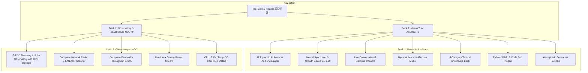

# Meena™ - Takahara Academy (高原学園)
## Next-Generation Home Personal Assistant & SBC Telemetry Architecture

This document serves as the master engineering guide, technical specification, and multi-phase execution roadmap for developing, deploying, and maintaining **Meena™** (*Master Electronic Executive Neural Assistant*) as a privacy-first **Home Personal Assistant & Smart Operations Hub** for home base **Takahara Academy (高原学園)** on **DietPi (Raspberry Pi 3)** (`192.168.0.100` / `dietpi.local`).

---

# Table of Contents
1. [Executive Summary & Core Philosophy](#1-executive-summary--core-philosophy)
2. [Dual-Deck Architecture Specification](#2-dual-deck-architecture-specification)
3. [Meena Neural Growth & EXP Engine](#3-meena-neural-growth--exp-engine)
4. [Target Hardware & Runtime Environment](#4-target-hardware--runtime-environment)
5. [System Architecture & Data Flow](#5-system-architecture--data-flow)
6. [Phased Implementation Roadmap](#6-phased-implementation-roadmap)
7. [Active Services Roster & Hotkeys](#7-active-services-roster--hotkeys)

---

# 1. Executive Summary & Core Philosophy

**Meena™ (高原学園)** is an intelligent, dual-deck **Home Personal Assistant & Operations Command Center** that manages self-hosted services (Pi-hole, File Browser, Syncthing, Tailscale, Cockpit) and real-time hardware telemetry for home base **Takahara Academy**.

### Core Tenets:
* **Zero-Cost, Privacy-First Home Assistant**: Powered by browser-native Web Speech Recognition API and Web Audio procedural synthesis with **0 token cost** and **0% CPU load on the Pi**.
* **Intelligent Vocal Assistant**: High-energy, charismatic assistant speaking fluent English with a natural Japanese accent and respectful honorifics, addressing the user as **Sensei**.
* **Dual-Deck Operations**: Deck 1 (Personal AI Assistant & Tactical Controls) and Deck 2 (3D Observatory & System NOC).
* **Neural Growth System**: Real-time Synapse EXP gain, Level 1-99 progression, and evolving assistant affinity.

---

# 2. Dual-Deck Architecture Specification

---

# 3. Meena Neural Growth & EXP Engine

Meena evolves over time as Sensei interacts with her:

* **Neural Synapse EXP Progression**:
  * Voice commands executed: `+10 EXP`
  * New knowledge taught: `+25 EXP`
  * System status check: `+5 EXP`
  * Daily morning greeting: `+50 EXP`
* **Ranks & Evolution Tiers**:
  * **Rank E (Lv. 1 - 10)**: *Cadet AI Assistant*
  * **Rank C (Lv. 11 - 25)**: *Tactical Operator* (Unlocks proactive morning/night briefings)
  * **Rank A (Lv. 26 - 50)**: *Chief Tactical Director* (Unlocks intelligent routine reminders)
  * **Rank EX (Lv. 50+)**: *Soulbound Guardian of Takahara* (Unlocks exclusive voice lines & auras)

---

# 4. Target Hardware & Runtime Environment

| Parameter | Specification | Notes |
| :--- | :--- | :--- |
| **Host Device** | Raspberry Pi 3 Model B | Quad-Core ARM Cortex-A53 @ 1.2GHz, 1GB LPDDR2 RAM |
| **Operating System** | DietPi (Debian Bookworm base) | Lightweight Linux distribution |
| **Web Server** | Nginx (or Lighttpd) | Static file serving at `/var/www/html/` & `/var/www/` |
| **Host Networking** | Static IP: `192.168.0.100` | Hostname: `dietpi.local` |
| **Telemetry Channel** | Local atomic file `api.json` | Generated every 1000ms by `bmb20-stats.sh` |

---

# 5. Phased Implementation Roadmap

### Milestone 1: Pi-hole Tactical Action Controls & Countdown (Completed)
- Clickable header Pi-hole badge with interactive action modal (`Disable 5 min`, `Disable 10 min`, `Enable`, `Update Gravity`).
- Real-time countdown timer in header badge with sudoers execution permissions.

### Milestone 2: Rebrand to Takahara Academy (高原学園) (Completed)
- Standardized facility brand to **Meena™ - Takahara Academy (高原学園)** with Kanji logo mark.
- Added dynamic time-of-day greeting engine and Sensei honorific.

### Milestone 3: Dual-Deck Operations & Neural Growth System (v2.0.0) (Completed)
- **Deck 1**: Holographic Avatar HUD, Neural Sync Level Lv. 1-99, 4-Category Knowledge Bank, Live Chat Feed.
- **Deck 2**: Full-screen 3D wireframe observatory stage, camera presets, LAN radar, and bandwidth charts.
- **Strict Female Voice Engine**: English replies with Japanese intonation by default.

### Milestone 4: Deck 3 Chrono Calendar & E-Solat Solar Matrix (Completed)
- **Chrono Calendar Core**: Multi-source ICS feed parser (`cal.php`) with sub-second caching and Google/Apple Calendar integration.
- **Automated Waktu Solat Engine**: Astronomical calculation of Malaysian prayer times with live solar arc track and Adhan briefings.

### Milestone 5: Deck 4 Computer Vision Sentry & Math OCR (v3.0.0) (Completed)
- **80% Widescreen Video Viewport & 20% Sidebar**: Expansive optical stage with real-time Multimodal Gemini Vision reasoning logs.
- **Anatomical Human Biometrics Engine**: $YC_bC_r$ & normalized chrominance segmenter with instant presence lock.
- **Alex Dunphy's Study Sentry**: Real-time cervical lordosis angle tracking ($88^\circ \rightarrow <70^\circ$) and 20-20-20 ocular rest timers.
- **Holographic Math & Document OCR**: Instant snapshot recognition and step-by-step LaTeX formula resolution.

### Milestone 6: Mobile PADD Communicator & Universal Growth Matrix (Completed)
- **Dynamic Mobile PADD Interface**: 100% live hardware chips, real-time Pi-hole toggle, prayer countdowns, and Hold-To-Talk voice interface.
- **Unified Level 1-99 Growth Sync**: Synced across Deck 1, Mobile PADD, AI Dossier, and System Settings (`settings.html`).

### Milestone 7: Smart Home & IoT Switch Control (Planned)
- Direct Home Assistant / Tasmota / Tuya smart plug & light control (*"Meena, living room lights on"*).

---

# 6. Active Services Roster & Hotkeys

| Identifier | Service | Port / URL | Description |
| :--- | :--- | :--- | :--- |
| **`[01-89]`** | **Pi-hole v6** | `http://dietpi.local:8089/admin/login` | DNS Ad-blocking & Network Shield |
| **`[80-84]`** | **File Browser** | `http://dietpi.local:8084/` | Web-based Local File Manager |
| **`[33-84]`** | **Syncthing** | `http://dietpi.local:8384` | Continuous File Synchronization |
| **`[10-52]`** | **Tailscale VPN** | `https://login.tailscale.com/admin/machines` | Secure Mesh Network Console |
| **`[52-52]`** | **Cockpit** | `http://dietpi.local:5252` | Linux Server Web Administration |

### Master Keyboard Hotkey Guide:
* **`1`**: Deck 1 (Meena™ AI Assistant)
* **`2`**: Deck 2 (3D Observatory & NOC)
* **`3`**: Code Red Alert Klaxon
* **`4`** / **`P`**: Terra 3D View
* **`5`** / **`S`**: Solar System 3D View
* **`6`** / **`G`**: Galaxy Map 3D View
* **`W`**: Warp Speed Thrusters
* **`V`**: Voice & Knowledge Console
* **`R`**: CRT Scanline Toggle
* **`M`** / **`A`**: Audio Mute / Unmute
